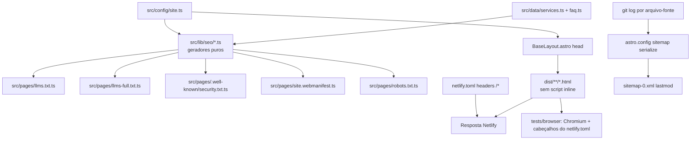

# Auditoria GEO e Segurança — Design

**Spec**: `.specs/features/auditoria-geo-seguranca/spec.md`
**Status**: Approved (2026-10-04, abordagem A)

---

## Architecture Overview

Nada muda na arquitetura (AD-003: Astro estático + Netlify Functions só para `/api/contato`). A feature soma três coisas:

1. **Cabeçalhos estáticos** num bloco `[[headers]] for = "/*"` do `netlify.toml`, com uma CSP fixa (`script-src 'self'`). Para essa CSP valer, nenhuma página pode ter script executável inline.
2. **Arquivos de texto gerados dos dados** (`/llms.txt`, `/llms-full.txt`, `/.well-known/security.txt`, `/site.webmanifest`), seguindo o padrão do `robots.txt.ts`: uma rota prerenderizada que chama um gerador puro em `src/lib/seo/`.
3. **Ajustes no `<head>` e nos componentes**: robots meta, `hreflang`, links de manifest e llms, título, JSON-LD, `<h3>` no FAQ, honeypot e fonte de fallback com métricas ajustadas.



### Abordagens para a CSP (escolha necessária)

| | A. CSP estática no `netlify.toml` ⭐ recomendada | B. `security.csp` do Astro + `staticHeaders` do adaptador | C. CSP em `<meta>` |
|-|-|-|-|
| Como | `script-src 'self'` fixo para `/*`. Scripts do Astro saem como arquivos (`vite.build.assetsInlineLimit: 0`, testado em 2026-10-04) e a classe `js` vira `@media (scripting: enabled)` | O Astro calcula hashes por página e o adaptador grava um cabeçalho por rota em `.netlify/v1/config.json` (confirmado em `node_modules/@astrojs/netlify/dist/index.js:91`) | O Astro injeta `<meta http-equiv>` |
| 404 em caminho qualquer | ✅ `/*` cobre | ❌ o cabeçalho é ligado à rota `/404`, e um caminho inexistente recebe `404.html` sem CSP | ✅ |
| Checker e `frame-ancestors` | ✅ | ✅ | ❌ o checker lê cabeçalho, e `frame-ancestors` é ignorado em meta |
| Manutenção | Script inline novo quebra a página, mas o teste de build (EDGE-09) avisa antes | Hashes mudam a cada build; depende de recurso pouco usado do adaptador | — |
| Peças móveis | 1 bloco TOML + 1 opção do Vite | Config do Astro + adaptador + TOML para os outros cabeçalhos | — |

**Recomendação: A.** É a única que cobre todo caminho com uma regra só, é testável lendo o `netlify.toml` (mesmo padrão de `tests/netlify-config.test.ts`) e não depende de recurso experimental. O custo são três requisições pequenas a mais (`Header`, `BaseLayout`, `Contact` já são módulos; hoje dois vêm inline). Elas são `type="module"`, portanto adiadas, e o Lighthouse local mede o efeito antes do commit (PERF-07).

---

## Code Reuse Analysis

### Existing Components to Leverage

| Component | Location | How to Use |
| --------- | -------- | ---------- |
| Rota de texto gerada da config | `src/pages/robots.txt.ts` | Mesmo padrão para `llms.txt`, `llms-full.txt`, `security.txt` e `site.webmanifest` |
| Teste de rota com config dublê | `src/pages/_robots.test.ts` | `vi.mock("../config/site")` + `GET()` para cada rota nova |
| Leitor de `netlify.toml` | `tests/netlify-config.test.ts` | Ganha um leitor de `[[headers]]` (ver abaixo) |
| Nós JSON-LD | `src/lib/seo/schema.ts` | `siteNodes` ganha `@type` em array e `knowsAbout` |
| `NAME`, `HOME_DESCRIPTION` | `src/lib/seo/schema.ts:7-11` | Fonte única para o cabeçalho do `llms.txt` |
| Validação de config no build | `src/config/schema.ts` + `astro.config.mjs:9` | Já falha com e-mail vazio (cobre EDGE-12 sem código novo) |
| Gerador de ícones | `scripts/icons.mjs` | Ganha `icon-192.png` |
| Render de componentes | `tests/render.ts` | Testes de `<head>`, FAQ e formulário |
| Dados dos serviços e FAQ | `src/data/services.ts`, `src/data/faq.ts` | Fonte do `llms*.txt` e do `knowsAbout` |
| Chrome do Playwright em cache | `~/.cache/ms-playwright/chromium-1243` | Teste de navegador (CSP-04..06) |

### Integration Points

| System | Integration Method |
| ------ | ------------------ |
| Netlify | `[[headers]]` no `netlify.toml`. As regras valem para arquivos estáticos e para o `404.html`; a resposta da função `/api/contato` não muda (EDGE-14) |
| `@astrojs/sitemap` | Opção `serialize(item)` em `astro.config.mjs` preenche `item.lastmod` |
| Git no build da Netlify | `git log -1 --format=%cI -- <arquivos>`; se o clone for raso (`git rev-parse --is-shallow-repository` = `true`) ou não houver git, nada é preenchido (SMAP-02) |

---

## Components

### Cabeçalhos de segurança

- **Purpose**: Mandar SECH-01..07, CSP-01..03 e HSTS (já vem da Netlify) em toda resposta.
- **Location**: `netlify.toml` (bloco `[[headers]] for = "/*"`)
- **Interfaces**: valores exatos:
  - `X-Content-Type-Options = "nosniff"`
  - `X-Frame-Options = "DENY"`
  - `Referrer-Policy = "strict-origin-when-cross-origin"`
  - `Permissions-Policy = "camera=(), microphone=(), geolocation=(), payment=(), usb=(), browsing-topics=()"`
  - `Cross-Origin-Opener-Policy = "same-origin"`
  - `Cross-Origin-Embedder-Policy = "require-corp"`
  - `Cross-Origin-Resource-Policy = "same-origin"`
  - `Content-Security-Policy = "default-src 'self'; script-src 'self'; style-src 'self' 'unsafe-inline'; img-src 'self' data:; font-src 'self'; connect-src 'self'; frame-ancestors 'none'; base-uri 'self'; form-action 'self'; object-src 'none'; upgrade-insecure-requests"`
- **Dependencies**: nenhum script inline nas páginas (próximo componente).
- **Reuses**: leitor de TOML do teste existente, estendido para `[[headers]]` + `[headers.values]`.

### Páginas sem script inline

- **Purpose**: Tornar `script-src 'self'` viável.
- **Location**: `astro.config.mjs` (`vite: { build: { assetsInlineLimit: 0 } }`), `src/layouts/BaseLayout.astro:36` (remove o `is:inline`), `src/styles/animations.css:256-298` (troca `html.js` por `@media (scripting: enabled)`).
- **Interfaces**: nenhuma. O teste de build varre `dist/**/*.html` e falha em qualquer `<script>` com corpo cujo `type` não seja `application/ld+json` (EDGE-09).
- **Dependencies**: navegadores com `scripting` (Chrome 120, Firefox 113, Safari 17). Nos mais antigos a media query não casa e o conteúdo aparece sem animação, o mesmo comportamento de hoje sem JS (ANIM-09).
- **Reuses**: ANIM-07..09 continuam válidos; só muda o gatilho do CSS.

### Gerador de robots.txt

- **Purpose**: BOT-01..03.
- **Location**: `src/pages/robots.txt.ts` (modifica)
- **Interfaces**: `AI_BOTS` (lista exportada com os 9 user-agents) e o mesmo `GET`. Saída: grupo `*` primeiro, depois um grupo por bot (`User-agent`, `Allow: /`, `Disallow: /api/`), e o `Sitemap:` no fim.
- **Reuses**: rota atual.

### Gerador do llms.txt e llms-full.txt

- **Purpose**: LLMS-01..10.
- **Location**: `src/lib/seo/llms.ts` + `src/pages/llms.txt.ts` + `src/pages/llms-full.txt.ts`
- **Interfaces**:
  - `llmsText(site: SiteConfig, list: Service[]): string`: `# NAME`, `> HOME_DESCRIPTION`, um parágrafo de contato (cidade, área, e-mail, WhatsApp, CNPJ), `## Páginas` (home, cada serviço com `description`, privacidade) e `## Optional` → `/llms-full.txt`
  - `llmsFullText(site: SiteConfig, list: Service[], faq: { q: string; a: string }[]): string`
- **Dependencies**: `services`, `questions` (faq), `NAME`, `HOME_DESCRIPTION`.
- **Reuses**: `abs()` de URL do `schema.ts` (mover para um `src/lib/seo/url.ts` só se a duplicação passar de uma linha; se não, repetir `new URL(path, site.url).href`).

### Gerador do security.txt

- **Purpose**: SECTXT-01..06, EDGE-11.
- **Location**: `src/lib/seo/security-txt.ts` + `src/pages/.well-known/security.txt.ts` (rota em pasta com ponto confirmada no build experimental de 2026-10-04)
- **Interfaces**: `securityTxt(site: SiteConfig, now: Date): string`. `Expires` = `now + 364 dias` em `toISOString()`, sem milissegundos (`2027-10-03T00:00:00Z`). A rota passa `new Date()`.
- **Reuses**: padrão do robots.

### Manifest

- **Purpose**: MANI-01/02.
- **Location**: `src/pages/site.webmanifest.ts` (JSON com `content-type: application/manifest+json`), `scripts/icons.mjs` (+ `public/icon-192.png`), `<link rel="manifest">` no `BaseLayout`.
- **Interfaces**: `name: NAME`, `short_name: "L. Assunção"`, os demais valores literais da spec.

### Head do BaseLayout

- **Purpose**: RMETA-01/02, LLMS-05, MANI-02, I18N-01/02, SEO-07.
- **Location**: `src/layouts/BaseLayout.astro`
- **Interfaces**: o `noindex` decide entre `robots noindex` e (canônica + `robots index, follow, max-snippet:-1, max-image-preview:large, max-video-preview:-1` + 2 `hreflang`). O título padrão passa a ser "Criação de Sites e Sistemas em Canoas/RS | Leonardo Assunção".

### JSON-LD

- **Purpose**: LD-10..14.
- **Location**: `src/lib/seo/schema.ts`, `src/config/site.ts`
- **Interfaces**: nó da empresa com `"@type": ["Organization", "ProfessionalService"]` e `knowsAbout: services.map(s => s.name)`. `site.linkedin` é preenchido. O `sameAs` já existe (LD-09).
- **Note**: os testes usam `byType(nodes, "ProfessionalService")`. O helper passa a aceitar `@type` em array.

### Sitemap com lastmod

- **Purpose**: SMAP-01/02.
- **Location**: `src/lib/seo/lastmod.ts` + `astro.config.mjs`
- **Interfaces**:
  - `lastCommitDate(files: string[], run?: (args: string[]) => string | undefined): string | undefined`: devolve a data ISO do último commit que tocou os arquivos; `undefined` se o clone for raso, se não houver git ou se o comando falhar. O `run` é injetável para teste.
  - `PAGE_SOURCES: Record<string, string[]>`: `"/"` → `src/pages/index.astro`, `src/components`, `src/data/faq.ts`, `src/layouts`; `"/<slug>/"` → `src/pages/[servico].astro`, `src/data/services.ts`, `src/layouts`; `"/privacidade/"` → `src/pages/privacidade.astro`, `src/layouts`.
  - Em `sitemap({ serialize })`, o caminho da URL escolhe as fontes, e o resultado vai para `item.lastmod` quando existe.

### FAQ, honeypot e fonte

- **FAQ** (`src/components/Faq.astro`): `<summary class="faq__question"><h3 class="faq__q">{q}</h3></summary>`, com `.faq__q { font: inherit; margin: 0; }` (A11Y-06).
- **Honeypot** (`src/components/Contact.astro:112`): tira `aria-hidden`, o rótulo vira "Deixe este campo em branco", e a classe `.contact-form__hp` continua fora da tela (A11Y-07/08). O `name="website"` não muda, então a API segue igual (A11Y-09).
- **Fonte de fallback** (`src/styles/tokens.css` / `global.css`): `@font-face { font-family: "Archivo Fallback"; src: local("Arial"); size-adjust; ascent-override; descent-override; line-gap-override }`, com valores calculados das métricas do `archivo-latin-wdth-normal.woff2` via fontTools (instalado: 4.62.1) e registrados num comentário. `--font-sans: "Archivo Variable", "Archivo Fallback", system-ui, sans-serif` (PERF-08).

### Teste de navegador

- **Purpose**: CSP-04..06, EDGE-10.
- **Location**: `tests/browser/csp.test.ts` + script `test:browser` no `package.json` (roda depois do `npm run build`).
- **Interfaces**: um servidor `node:http` serve `dist/` aplicando os cabeçalhos lidos do `netlify.toml`; o Playwright (`playwright-core`, nova devDependency, usando o Chromium do cache) abre `/`, `/criacao-de-sites/`, `/privacidade/` e um caminho inexistente (404); coleta `console`/`pageerror`/`requestfailed`; confere `.reveal.is-visible`, abre e fecha o menu em 390 px; preenche o formulário com `page.route("/api/contato")` respondendo `200 {"ok":true}` e espera o estado de sucesso.
- **Dependencies**: `playwright-core` com a versão cujo Chromium é o `1243` do cache (conferir na instalação; se não bater, `npx playwright install chromium`).

### Medição de CLS

- **Purpose**: PERF-05..07.
- **Location**: `scripts/lighthouse.mjs` (manual, fora do `npm test`): serve `dist/` e roda `npx lighthouse@12` mobile 3× em `/` e `/criacao-de-sites/`, imprime CLS e Performance e sai com código ≠ 0 se algum CLS > 0,1 ou Performance < 95.

---

## Data Models

```typescript
// src/pages/robots.txt.ts
export const AI_BOTS = [
  "GPTBot", "OAI-SearchBot", "ChatGPT-User",
  "ClaudeBot", "Claude-User", "Claude-SearchBot",
  "PerplexityBot", "Perplexity-User", "Google-Extended",
] as const;
```

Sem novos campos em `SiteConfig`: `linkedin` já existe (`src/config/schema.ts:18`).

---

## Error Handling Strategy

| Error Scenario | Handling | User Impact |
| -------------- | -------- | ----------- |
| Script inline novo numa página | Teste de build falha nomeando o arquivo (EDGE-09) | Nenhum: não chega ao deploy |
| Recurso de outra origem | Teste de navegador falha nomeando a URL (EDGE-10) | Nenhum |
| Sem git / clone raso no build | `lastCommitDate` devolve `undefined`; o sitemap sai sem `lastmod` (SMAP-02) | Nenhum |
| `git` falha (binário ausente) | `try/catch` no `run` → `undefined` | Nenhum |
| E-mail vazio na config | `validateSiteConfig` já derruba o build (PAGE-09) | Nenhum |
| JS bloqueado por CSP em produção | `@media (scripting: enabled)` esconde `.reveal` só quando há script; se o módulo falhar, o conteúdo fica com opacidade 0. Mitigação: o teste de navegador cobre isso antes do deploy | Seções invisíveis (pego pelo CSP-06) |

---

## Risks & Concerns

| Concern | Location (file:line) | Impact | Mitigation |
| ------- | -------------------- | ------ | ---------- |
| `.reveal` escondido depende de JS rodar | `src/styles/animations.css:256` | Com CSP errada, as seções somem | CSP-06 no teste de navegador; `scripting: enabled` só esconde quando há JS |
| CLS 0,32 do PSI não reproduzido | — | Pode voltar depois do deploy | Corrige a única causa observada (troca de fonte); `scripts/lighthouse.mjs` + PSI pós-deploy no checklist; se persistir, abre investigação com o trace do PSI |
| Clone raso na Netlify | `astro.config.mjs` | `lastmod` igual para tudo = mentira | Detecta `--is-shallow-repository` e omite (SMAP-02) |
| Checker pode não ler `@type` em array | `src/lib/seo/schema.ts:30` | Continua "Organization ausente" | Válido no schema.org; registrado como falso positivo se acontecer |
| Teste depende do helper `byType` com string | `src/lib/seo/schema.test.ts` | Testes de LD-02..09 quebram | Atualizar o helper na mesma tarefa |
| `site.test.ts:24` afirma "sem LinkedIn" | `src/config/site.test.ts:24` | Falha ao preencher | Teste atualizado para o valor novo na mesma tarefa |
| COEP `require-corp` pode bloquear recurso futuro de terceiros (ex.: analytics) | `netlify.toml` | Script novo não carrega | EDGE-10 avisa; trocar para `credentialless` quando houver analytics |
| `security.txt` vence sem deploy por 1 ano | `src/lib/seo/security-txt.ts` | Arquivo inválido | Checklist: deploy pelo menos anual (o site muda com mais frequência) |

---

## Tech Decisions

| Decision | Choice | Rationale |
| -------- | ------ | --------- |
| Onde mora a CSP | Cabeçalho fixo no `netlify.toml` (abordagem A) | Cobre todo caminho, incluindo a 404; testável sem build; sem hashes |
| Classe `js` | `@media (scripting: enabled)` em vez de script inline | Elimina o único script inline necessário antes da pintura |
| Scripts do Astro | `vite.build.assetsInlineLimit: 0` | Força arquivo externo; não há imagens/fontes inline hoje (`data:` ausente no `dist/`) |
| Teste de navegador | `playwright-core` + Chromium em cache | Único jeito de provar que a CSP não quebra nada; já há navegador local |
| `lastmod` | Data do commit por grupo de arquivos-fonte | Reflete mudança real; resolve a objeção da spec anterior |

> **Project-level decision:** "Nenhum script executável inline; CSP com `script-src 'self'` no `netlify.toml`" vira **AD-005** no `STATE.md` quando o Design for aprovado, porque restringe toda feature futura.
