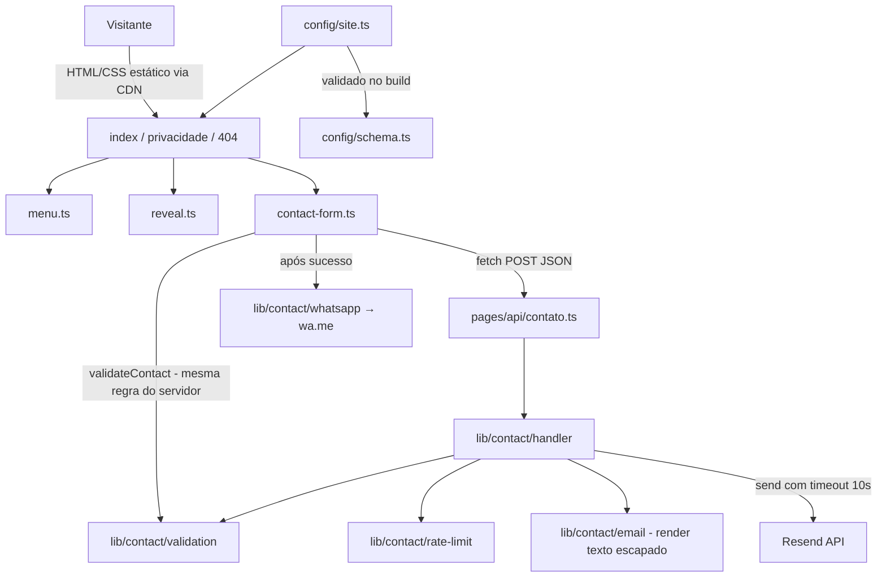

# Site Institucional Design

**Spec**: `.specs/features/site-institucional/spec.md`
**Context**: `.specs/features/site-institucional/context.md`
**Status**: Approved (abordagem escolhida pelo usuário: Astro + Vercel; testes: só unitários)

---

## Architecture Overview

Site estático gerado pelo Astro (`output: 'static'`). Só o endpoint `POST /api/contato` roda sob demanda (`export const prerender = false`) como função serverless da Vercel, via `@astrojs/vercel`. O e-mail sai pelo Resend. Toda regra de negócio do contato vive em módulos TypeScript puros com dependências injetadas, para ser testada por unidade sem rede nem `astro:env`.



**Estratégia de animação (spec ANIM):** CSS puro para entrada do título, palavra alternada, faixa, hover e fluxo de integrações. A revelação ao rolar usa `IntersectionObserver` em `reveal.ts` (funciona em todos os navegadores suportados, ao contrário de `animation-timeline: view()`, que não existe no Firefox/Safari estáveis). O estado escondido só se aplica quando `<html>` tem a classe `js`, colocada por um script inline no `<head>`; sem JavaScript tudo fica visível (ANIM-09). `@media (prefers-reduced-motion: reduce)` desliga todas as animações e troca a palavra alternada pelo texto fixo "software" (ANIM-08).

---

## Code Reuse Analysis

### Existing Components to Leverage

| Component | Location | How to Use |
| --------- | -------- | ---------- |
| Protótipo aprovado do Claude Design | https://claude.ai/artifact/MmTLyPvYTwvrUfahAWqsYj (`project/Main.dc.html`) | Fonte de verdade para textos, espaçamentos, tamanhos de fonte, keyframes e paleta "marinho". Copiar valores, não reinventar. |
| Fonte Archivo variável (eixos wdth 62–125, wght 100–900) | `@fontsource-variable/archivo/wdth.css` | Auto-hospedada no próprio domínio (SEO-06). |
| `@astrojs/sitemap` | npm | Gera `sitemap-index.xml` (SEO-03). |

O repositório está vazio (só `.claude/`), então não há código próprio a reaproveitar.

### Integration Points

| System | Integration Method |
| ------ | ------------------ |
| Resend | SDK `resend` chamado no endpoint; chave em `RESEND_API_KEY` (`astro:env`, `context: "server"`, `access: "secret"`). |
| Vercel | Adaptador `@astrojs/vercel`; endpoint vira função serverless, o resto é estático no CDN. |
| WhatsApp | Link `https://wa.me/<número>?text=<texto codificado>`; sem API. |

---

## Components

### Configuração do site

- **Purpose**: Conteúdo editável (contatos, projetos, depoimento) num único arquivo, validado no build.
- **Location**: `src/config/schema.ts`, `src/config/site.ts`
- **Interfaces**:
  - `siteSchema` (zod) — formato de `SiteConfig`.
  - `validateSiteConfig(input: unknown): SiteConfig` — lança `Error("Configuração inválida: <campo> …")` quando um campo obrigatório está vazio ou contém `[`…`]`.
- **Dependencies**: `zod`
- **Reuses**: textos do protótipo.
- **Build gate**: `astro.config.mjs` importa `site.ts` e chama `validateSiteConfig` no topo; erro → build falha (PAGE-09).

### Lógica do contato (domínio)

- **Location**: `src/lib/contact/`
- **Interfaces**:
  - `validation.ts`: `validateContact(input: unknown): { ok: true; data: ContactInput } | { ok: false; errors: Partial<Record<ContactField, string>> }` — regras de FORM-04, mensagens em pt-BR; usado no navegador e no servidor.
  - `rate-limit.ts`: `createRateLimiter(opts: { limit: number; windowMs: number; now?: () => number }): { hit(key: string): boolean }` — `true` = permitido. Janela deslizante em `Map` na memória.
  - `whatsapp.ts`: `buildWhatsAppUrl(phone: string, info: { nome: string; tipo: ProjectType }): string`.
  - `email.ts`: `renderContactEmail(data: ContactInput): { subject: string; text: string; html: string }` — HTML com escape de `& < > " '`.
  - `handler.ts`: `handleContact(request: Request, deps: ContactDeps): Promise<Response>` onde `ContactDeps = { send(mail: OutgoingMail): Promise<void>; limiter: RateLimiter; to: string; from: string; timeoutMs: number; log(entry: { at: string; code: string }): void; clientIp: string }`.
- **Dependencies**: `zod` (validação).

### Endpoint

- **Purpose**: Ligar `handleContact` ao Resend e às variáveis de ambiente.
- **Location**: `src/pages/api/contato.ts`
- **Interfaces**: `export const prerender = false; export const POST: APIRoute`
- **Dependencies**: `resend`, `astro:env/server` (`RESEND_API_KEY`, `CONTACT_TO`, `CONTACT_FROM`), `clientAddress` do Astro para o IP.
- **Reuses**: instância única de `createRateLimiter({ limit: 5, windowMs: 3_600_000 })` no escopo do módulo.

### Layout e componentes visuais

- **Location**: `src/layouts/BaseLayout.astro`, `src/components/*.astro`, `src/pages/{index,privacidade,404}.astro`
- **Componentes**: `Seo`, `Header`, `Hero`, `Marquee`, `Services`, `Integrations`, `Commitments`, `Process`, `Projects`, `Testimonial`, `Faq`, `Contact`, `Footer`.
- **Interfaces**: cada componente recebe por props só o que é dinâmico (`site: SiteConfig` ou um recorte dele); textos fixos ficam no markup.
- **Estilos**: `src/styles/tokens.css` (custom properties da paleta marinho, escala tipográfica), `src/styles/global.css` (reset, base, utilitários de layout), `src/styles/animations.css` (keyframes e classes `lg-*` portadas do protótipo).

### Scripts do navegador

- **Location**: `src/scripts/`
- **Interfaces**:
  - `menu.ts`: `initMenu(root: HTMLElement): () => void` — abre/fecha painel, Esc, clique em link; mantém `aria-expanded`.
  - `reveal.ts`: `initReveal(doc: Document, opts?: { reducedMotion?: boolean }): () => void` — adiciona `is-visible` uma vez por elemento `.reveal` ao entrar na tela.
  - `contact-form.ts`: `initContactForm(form: HTMLFormElement, deps: { fetch: typeof fetch; whatsappPhone: string; email: string; responseTime: string }): void` — estados `idle → sending → success | error | rate-limited`.

---

## Data Models

```typescript
type ProjectType = 'Site' | 'Sistema web' | 'Integração' | 'Outro'
type ContactField = 'nome' | 'email' | 'tipo' | 'mensagem'

interface ContactInput {
  nome: string      // 2–100, trim
  email: string     // formato e-mail, ≤ 254
  tipo: ProjectType
  mensagem: string  // 10–2000, trim
  website?: string  // honeypot: precisa vir vazio
}

interface SiteConfig {
  url: string                 // domínio canônico, ex. https://leonardoassuncao.com.br
  email: string
  whatsapp: string            // só dígitos com DDI, ex. 5511999999999
  whatsappDisplay: string     // ex. (11) 99999-9999
  linkedin: string            // URL
  cidade: string              // "Cidade, UF"
  cnpj: string                // 00.000.000/0000-00
  prazoResposta: string       // ex. "24 horas úteis"
  projetos: Array<{ nome: string; categoria: string; ano: string; descricao: string; imagem: string; alt: string }>
  depoimento?: { texto: string; autor: string; cargo: string; empresa: string }
}
```

Respostas do endpoint: `200 { ok: true }` · `400 { ok: false, errors: {campo: mensagem} }` · `429 { ok: false, code: "rate_limited" }` · `502 { ok: false, code: "send_failed" }`.

---

## Error Handling Strategy

| Error Scenario | Handling | User Impact |
| -------------- | -------- | ----------- |
| Campo inválido no navegador | `validateContact` antes do `fetch`; erros por campo com `aria-describedby` | Mensagem abaixo do campo; nada é enviado |
| Campo inválido no servidor | 400 com mapa de erros | Mesmas mensagens nos campos |
| Honeypot preenchido | 200 sem chamar `send` | Bot vê "sucesso" |
| Mais de 5 envios/IP/60min | 429 antes de chamar `send` | "Muitas tentativas…" + link WhatsApp |
| Resend falha ou passa de 10s | `Promise.race` com timeout → 502; `log({at, code})` sem dados pessoais | "Não foi possível enviar agora." + WhatsApp/e-mail; campos preservados |
| Falha de rede no navegador | `fetch` rejeita → mesmo estado do 502 | Igual ao acima |
| JSON malformado | 400 `{ errors: {} }` | Mensagem genérica de erro |
| Config com placeholder | `validateSiteConfig` lança no `astro.config.mjs` | Build falha nomeando o campo |

---

## Risks & Concerns

| Concern | Location (file:line) | Impact | Mitigation |
| ------- | -------------------- | ------ | ---------- |
| Limite em memória zera a cada cold start e não é compartilhado entre instâncias serverless | `src/lib/contact/rate-limit.ts` | Um robô persistente pode passar de 5/h | Aceito na spec (premissa); honeypot cobre a maior parte do spam; trocar por armazenamento externo se aparecer abuso. |
| Container API do Astro é experimental ("breaking changes even in patch releases") | `src/components/*.test.ts` | Atualizar o Astro pode quebrar os testes de componente | Fixar a versão exata do `astro` no `package.json`; um único helper `renderComponent` em `tests/render.ts` concentra o uso da API. |
| Resend só envia de domínio verificado; antes disso só entrega para o e-mail da conta | `src/pages/api/contato.ts` | Formulário não entrega em produção sem DNS configurado | Pré-requisito de publicação: verificar o domínio no Resend (fora do código; listado na entrega). |
| Pasta de saída do build com o adaptador Vercel (`.vercel/output/static`) não confirmada para Astro 7 | `tests/build/secrets.test.ts` | Teste de vazamento de segredo pode olhar a pasta errada | T10 confirma a pasta real após o primeiro build e o teste falha se a pasta não existir (nunca passa vazio). |
| `IntersectionObserver` ausente em ambiente de teste | `src/scripts/reveal.ts` | Testes de reveal precisam de dublê | Testes injetam um `IntersectionObserver` falso no `happy-dom`. |
| Testes só unitários: layout responsivo, contraste, Lighthouse e visual das animações não têm teste automatizado | RESP-01, RESP-05, RESP-06, A11Y-01, A11Y-02, SEO-05, ANIM-01..06, ANIM-10 | Regressão visual passa pelo gate | Decisão do usuário. Esses itens viram checklist manual na validação final (Verifier + UAT), com evidência registrada em `validation.md`. |

---

## Tech Decisions (only non-obvious ones)

| Decision | Choice | Rationale |
| -------- | ------ | --------- |
| Framework | Astro 7 estático + 1 endpoint sob demanda | Escolha do usuário; quase zero JS no navegador favorece Lighthouse ≥ 90. Registrado em AD-001. |
| Envio de e-mail | Resend | API simples, SDK oficial, plano gratuito cobre o volume. Registrado em AD-002. |
| Validação | zod, mesmo `validateContact` no navegador e no servidor | Uma regra só, sem divergência de mensagens. |
| Revelação ao rolar | `IntersectionObserver` em vez de `animation-timeline` | Suporte em Firefox/Safari (spec: duas últimas versões de cada). |
| Testes de componente | Vitest + `experimental_AstroContainer.renderToString` | Usuário escolheu só unitários; renderizar o HTML permite testar conteúdo, ordem e atributos sem navegador. |
| Testes de scripts do navegador | Vitest com ambiente `happy-dom` por arquivo | DOM leve, sem navegador real. |
| Mobile menu | `<button aria-expanded>` + painel; sem biblioteca | Comportamento pequeno (RESP-02..04). |
